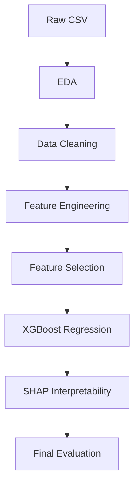

# 🏠 ML Housing Price Prediction

> **Goal:** Build an end-to-end machine learning pipeline that predicts housing prices in Ames, Iowa using **79 structured features**, with a focus on **feature engineering**, **explainability**, and **robust regression modeling**.
>
> **Scenario:** A real-estate investment platform wants to forecast residential home prices to better evaluate potential investments. This model enables:
> • Pricing recommendations for property acquisition
> • Transparent explanations for predicted prices
> • A reproducible framework for tabular regression problems

---

## 0 Project Workflow Outline



---

## 1 Plan → Execution

| Stage | Artefact | Key Choices & Rationale |
|-------|----------|--------------------------|
| **EDA** | `notebooks/eda.ipynb` | Visualized relationships between features and `SalePrice`; explored skew, outliers, missing data |
| **Cleaning** | `notebooks/eda.ipynb` | Imputed missing values with domain logic (`LotFrontage` by neighborhood, encoded nulls like `NoPool`) |
| **Feature Engineering** | `notebooks/feature_engineering.ipynb` | Created high-signal variables: `TotalSF`, `TotalBath`, `HouseAge`, `RemodAge`, interaction terms like `Qual_LivArea_Interaction` |
| **Feature Selection** | `notebooks/model.ipynb` | Used Pearson correlation + XGBoost importance + Recursive Feature Elimination (RFE) |
| **Modeling** | `notebooks/model.ipynb` | Trained XGBoost with tuned parameters; optimized on log-RMSE; trained on 30 selected features |
| **Interpretability** | `notebooks/model.ipynb` | Used SHAP to explain predictions; isolated top 25 most influential features |
| **Evaluation** | `notebooks/model.ipynb` | Achieved final RMSE ≈ **28,395** (log scale); validated consistent feature impact |

---

## 2 Outcomes

| KPI (Hold-out Dev Set) | Value |
|------------------------|-------------------|
| **RMSE (log-scale)** | **29,185** |
| Final Model | XGBoost (n_estimators=200, max_depth=3, lr=0.02) |
| Key Features (Top SHAP) | `TotalSF`, `OverallQual`, `FireplaceQu`, `GarageCars`, `RemodAge`, `LotArea`, `BsmtFinSF1`, `ExterQual`, etc. |

---

## 3 Decisions & Trade‑offs

* **Why XGBoost over linear models or random forests?**
  - Captured nonlinearities in categorical/ordinal features
  - Outperformed linear baselines in cross-validation RMSE
  - Fast inference and native feature importance support

* **Why SHAP?**
  - Transparent model reasoning
  - Validated that the model relies on domain-relevant drivers (e.g., `GarageCars`, `OverallQual`)

* **Why log(RMSE) as metric?**
  - Better reflects proportional error
  - Reduces influence of outliers (expensive homes)

---

## 4 Real‑World Fit

This model simulates what a **real-estate investment team** or **automated valuation platform (AVM)** might deploy for:

- **Property acquisition** price predictions
- **Appraisal guidance** for mortgage underwriting
- **Interactive dashboards** for analysts to explore price drivers
- **Explainable ML workflows** to align with regulatory needs in financial tech

---

## 5 Assumptions & Limitations

| Area | Notes |
|------|-------|
| **Data Distribution** | Model is trained on Ames, Iowa — performance may degrade outside this geography |
| **Feature Drift** | Assumes future data (e.g., home quality, sales trends) are similar to the historical training set |
| **Outliers** | Log-transform reduces skew, but some very high-end properties still introduce variance |
| **Model Scope** | Not deployed; designed for offline simulations and reproducible analysis, not API production |

---

## 6 Quick‑start

### Run Entire Workflow Automatically
This project includes a Python script that **automatically executes the entire notebook pipeline** using `asyncio` and a custom Jupyter runner (`run_notebook.py`). Each step is executed in order, and outputs are saved as executed `.ipynb` notebooks for reproducibility.

```bash
python scripts/main.py
```

This will execute the following notebooks:

- `notebooks/eda.ipynb`
- `notebooks/baseline_models.ipynb`
- `notebooks/feature_engineering.ipynb`
- `notebooks/model.ipynb`

All executed outputs are saved to:

```
notebooks/outputs/
├── eda_executed.ipynb
├── baseline_models_executed.ipynb
├── feature_engineering_executed.ipynb
└── model_executed.ipynb
```

---

### Manual Setup Instructions

```bash
# Requires Python ≥ 3.10
git clone https://github.com/sharkz0912/ames-housing-xgboost.git
cd ames-housing-xgboost

# Create virtual environment
python -m venv .venv && source .venv/bin/activate  # Windows: .venv\Scripts\activate
pip install -r requirements.txt

# Run notebooks individually (if needed)
jupyter lab notebooks/eda.ipynb
jupyter lab notebooks/baseline_models.ipynb
jupyter lab notebooks/feature_engineering.ipynb
jupyter lab notebooks/model.ipynb
```

---

## 7 Repo Map

```
.
├── data/                             # Raw and processed CSV files
├── notebooks/
│   ├── eda.ipynb                     # Data inspection, missingness, 
│   ├── baseline_model.ipynb          # Explore basic model types
│   ├── feature_engineering.ipynb     # New features
│   └── model.ipynb                   # XGBoost model training and SHAP analysis
├── outputs/                          # Cached notebooks
├── requirements.txt                  # Dependencies
├── visualizations/                   # Feature Plots
├── scripts/                          # Run Pipeline
└── README.md                         # Project overview
```

---

## 8 Future Work

- Add LightGBM and CatBoost comparisons
- Tune hyperparameters with Optuna
- Add residual analysis with plots of over- and under-predictions
- Build Streamlit dashboard for interactive predictions and SHAP explanations
- Package code into a deployable FastAPI or Flask endpoint

---

## 9 Contact & Dataset

**Contact:**
- Name: Srikar Rairao  
- Email: `rairao.srikar@gmail.com`  
- GitHub: [https://github.com/sharkz0912](https://github.com/sharkz0912)  
- LinkedIn: [linkedin.com/in/srikar-rairao](https://linkedin.com/in/srikar-rairao)

**Dataset:**
Based on the [Ames Housing Kaggle competition](https://www.kaggle.com/c/house-prices-advanced-regression-techniques), compiled by Dean De Cock.

License: **CC BY-NC-SA 4.0**